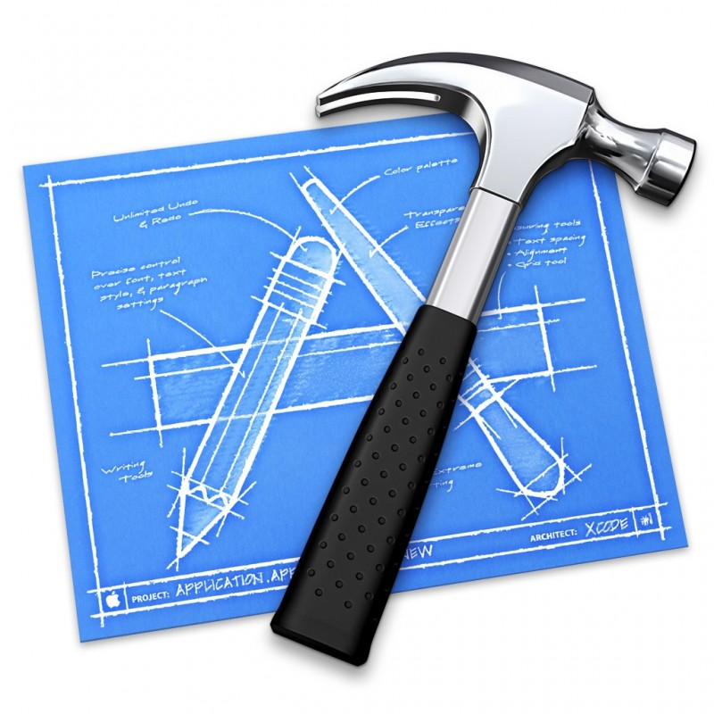

# Apuntes del módulo de Entornos de Desarrollo

1ºDAW  
Curso 2017-18  
Écija (Sevilla)

## Contenidos del módulo

[Unidad 1: Elementos de desarrollo del software](1.Elementos.md)    
[Unidad 2: Entornos integrados de desarrollo](2.Entornos.md)  
[Unidad 3: Diseño y realización de pureba](3.Pruebas.md)  
[Unidad 4: Documentación y optimización](4.Documentación.md)  
[Unidad 5: Elaboración de diagramas de clases](5.Diagramas.md)  
[Unidad 6: Elaboración de diagramas de de comportamiento](6.Diagrama_Comportamientos.md)  

